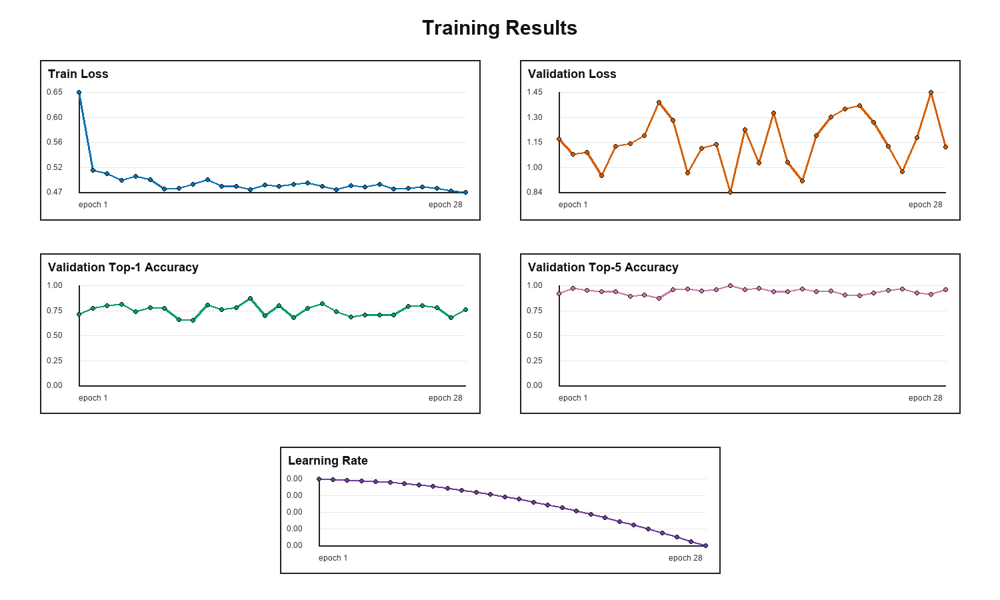
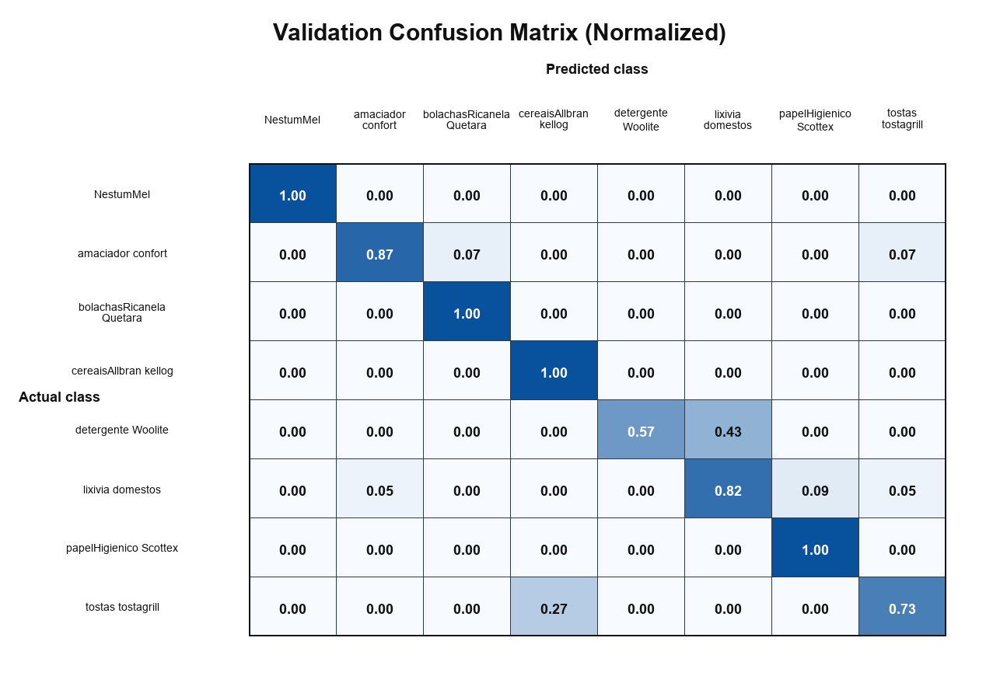
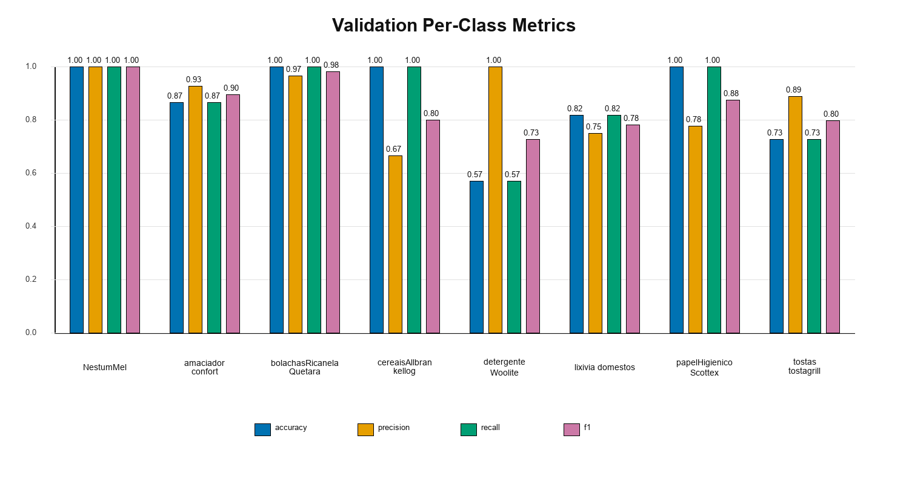
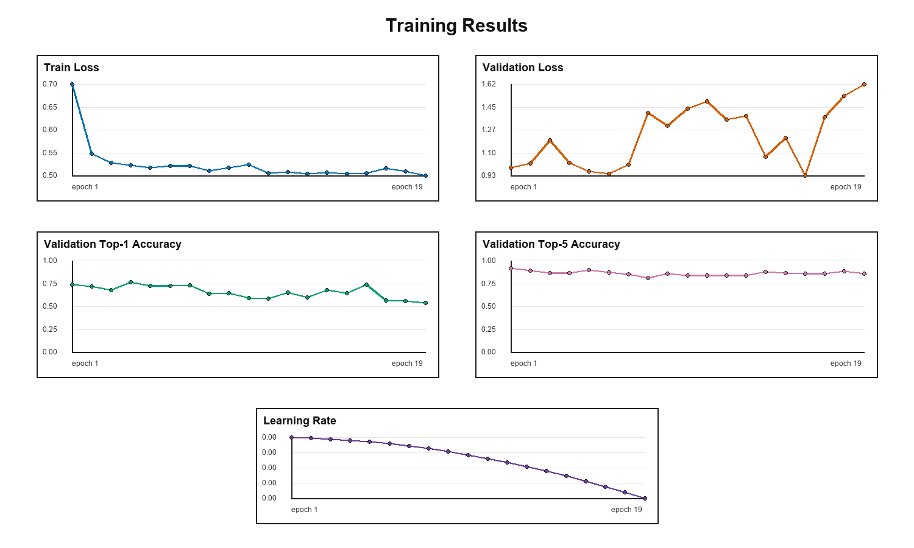
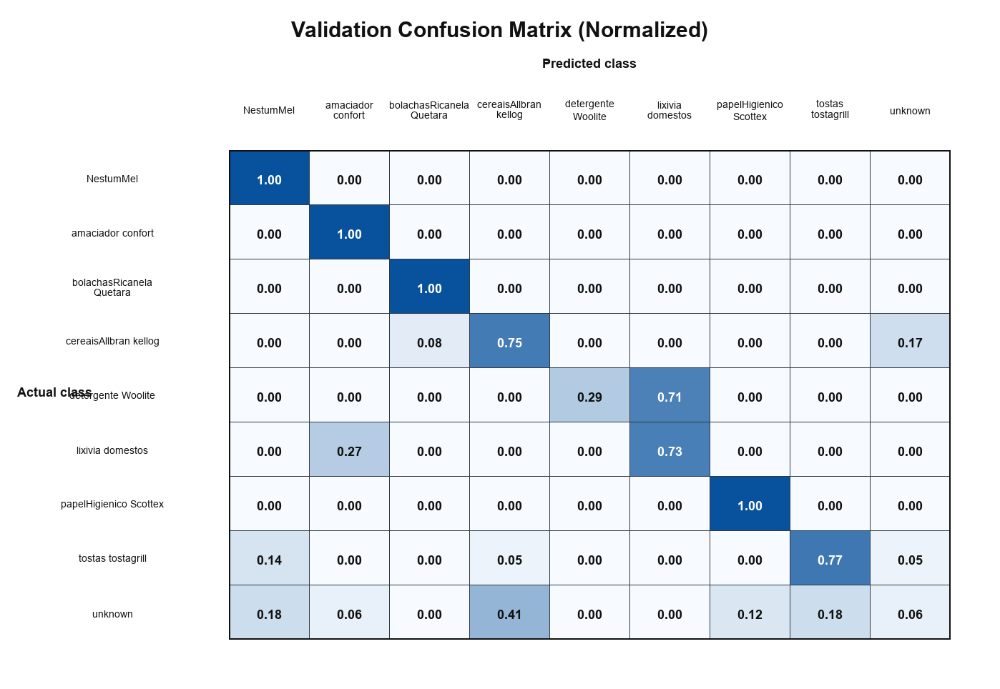
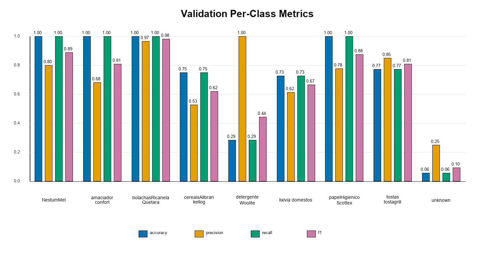

# Product-Classification Solution

## Problem:
The goal is to build a Python/PyTorch-based neural network solution for classifying product images into 9 classes, using a synthetic training set and a real-image validation set stored in /data. The main challenge is that the train and validation distributions differ intentionally: the training data contains only synthetic images, while the validation data contains only real images, and the product selections may not fully match between the two sets. The validation data must be used only for evaluation, not merged into training, so the task requires exploring strategies that improve generalization from synthetic to real images

## Solution:

The task is grocery product classification. The training data is synthetic, while the validation data consists of real product images. Therefore, the main challenge is domain generalization: the trained model must learn from synthetic examples and generalize to real-world validation images.

This is not treated as an object detection problem. In a detection setting, all items in a shopping basket would first need to be detected, segmented or masked, cropped, and then classified. Here, each input image is already cropped to a single product. Therefore, the solution uses image classification directly and does not require the `*_mask.png` files.

To begin the solution, and knowing that domain generalization is the key issue, I first simplify the problem as a standard classification task where the training and validation sets have the same class set. In that setup, `cafeAlma_Nicola` is removed from training and `pensoHigienico_Evax` is removed from validation. This allows the models to be compared under a closed-set classification assumption. After selecting the best-performing model, I then add a mechanism to handle the mismatch between the training and validation classes.

## Train / Validation Overlapping Class Set

For the case where the train and validation folders have matching classes, and knowing that the training data is synthetic while the validation data is real, the following considerations are used to improve generalization and reduce overfitting:

- The validation data is not used for training and is used only for model evaluation.
- Strong data augmentation is used to reduce overfitting and improve generalization to real images.
- Pretrained models are used instead of training from scratch, providing better generalization and faster convergence.
- Model ensembling can be considered when different models perform better on different classes and the goal is to improve performance across all classes.
- Because the solution may need to run on a machine without very strong compute, model size and inference speed are important. The evaluation should be practical for near real-time use.

Considering these points, three model families are evaluated: CNN-based models, Transformer-based models, and YOLO classification models. The strongest-performing models are then considered for the next step.

## Model Descriptions

| Model | Type | Compact explanation |
|---|---|---|
| `swin-tiny` | Vision Transformer | Tiny Swin Transformer model. It uses shifted-window self-attention, where attention is computed inside local windows and shifted between layers. In this project, `swin_tiny_patch4_window7_224.ms_in22k_ft_in1k` uses 224 x 224 inputs, ImageNet-22k pretraining, ImageNet-1k fine-tuning, and has about 28.3M parameters. |
| `convnext-tiny` | CNN / modern ConvNet | Tiny ConvNeXt model. ConvNeXt is a pure convolutional network modernized with design choices inspired by Vision Transformers. In this project, `convnext_tiny.fb_in22k_ft_in1k` uses 224 x 224 inputs, ImageNet-22k pretraining, ImageNet-1k fine-tuning, and has about 28.6M parameters. |
| `resnet50` | CNN / residual network | 50-layer residual convolutional network. It uses skip connections to make deep CNN training easier and more stable. In this project, it has about 25.6M parameters. |
| `mobilenetv4s` | CNN / lightweight mobile model | Small MobileNetV4-style model designed for efficient classification with a much smaller model size. In this project, it has about 3.77M parameters, making it much lighter than ResNet50, Swin-Tiny, and ConvNeXt-Tiny. |
| `yolo...-cls` | YOLO / classification model | `yolov8-cls`, `yolo11-cls`, and `yolo26-cls` classification models. These are lightweight pretrained classifiers designed for fast inference and can be used in nano, small, and medium sizes. |

Using a patience of 15 epochs, meaning training stops if validation accuracy does not improve for 15 epochs, the following results are obtained.

## Comparison Table For Reporting Results

The batch size differs between some models because changing the batch size from 16 to 24 produced better performance in some scenarios, so the better-performing value was kept.

| Model | Params | Best Val Acc | Epoch-max | Batch size | Train Time/epoch |
|---|---:|---:|---:|---:|---:|
| `yolo11n-cls` | 1.60M | 0.785 | 3 | 16 | ~22s |
| `yolov8n-cls` | 2.70M | 0.715 | 7 | 24 | ~20s |
| `yolo26n-cls` | 2.80M | 0.785 | 21 | 24 | ~21s |
| `yolo11s-cls` | 5.50M | 0.715 | 2 | 16 | ~22s |
| `yolov8s-cls` | 6.40M | 0.719 | 7 | 16 | ~21s |
| `yolo26s-cls` | 6.70M | 0.736 | 13 | 16 | ~25s |
| `yolo11m-cls` | 10.4M | 0.708 | 4 | 16 | ~41s |
| `yolo26m-cls` | 11.6M | 0.667 | 61 | 24 | ~41s |
| `yolov8m-cls` | 17.0M | 0.736 | 27 | 16 | ~36s |
| `swin-tiny` | 28.3M | 0.842 | 15 | 16 | ~78s |
| `convnext-tiny` | 28.6M | 0.863 | 1 | 16 | ~77s |
| **`resnet50`** | 25.6M | **0.877** | 13 | 16 | ~76s |
| `mobilenetv4s` | 3.77M | 0.870 | 2 | 16 | ~76s |
| `mobilenetv4m` | 9.7M | 0.842 | 8 | 16 | ~77s |
| **`mobilenetv4hm`** | 11.1M | **0.877** | 1 | 16 | ~77s |

<figure>
  
  <figcaption><b>Figure 1.</b> Learning curves for ResNet50 - 8 classes.</figcaption>
</figure>

<figure>
  
  <figcaption><b>Figure 2.</b> Normalized validation confusion matrix for ResNet50 - 8 classes.</figcaption>
</figure>

<figure>
  
  <figcaption><b>Figure 3.</b> Per-class validation metrics for ResNet50 - 8 classes.</figcaption>
</figure>

## Handling The Train / Validation Class Mismatch

The training and validation sets do not fully contain the same product classes. The training set contains 9 synthetic classes, while the validation set contains 9 real-image classes. One class in the training set, `cafeAlma_Nicola`, is not present in validation, and one class in validation, `pensoHigienico_Evax`, is not present in training.

This means the task is not a standard closed-set classification problem, where all validation classes are assumed to be present during training. Instead, the task has a partial open-set characteristic: the validation set contains at least one class that is unseen during training.

Because the model cannot learn a class that does not exist in the training data, the model is trained on the 9 available training classes and an additional rejection mechanism is added for unknown samples. At inference time, if the model's maximum predicted probability is below a chosen confidence threshold, the sample is assigned to an `unknown` class instead of being forced into one of the known training classes.

The intended behavior is:

- Images from the 8 classes shared between train and validation should be classified into their correct known classes.
- Images from the validation-only class should ideally receive low confidence for all known classes and be assigned to `unknown`.
- Images from the train-only class are learned during training, but since that class does not appear in validation, it does not contribute to validation accuracy.

This approach is more appropriate than forcing every validation image into one of the 9 training classes, because the validation-only class has no corresponding training examples. The `unknown` class acts as an unknown-class rejection option for samples that do not confidently match any known training class.

## Important Caveat And Results

A sample belonging to the validation-only class should be counted as a correct prediction when it is predicted as `unknown`. Using ResNet50 in this scenario resulted in an accuracy of **0.754**, with the following details:

<figure>
  
  <figcaption><b>Figure 4.</b> Learning curves for ResNet50 - 9 classes.</figcaption>
</figure>

<figure>
  
  <figcaption><b>Figure 5.</b> Normalized validation confusion matrix for ResNet50 - 9 classes.</figcaption>
</figure>

<figure>
  
  <figcaption><b>Figure 6.</b> Per-class validation metrics for ResNet50 - 9 classes.</figcaption>
</figure>

## Instructions

Select the model in `train_config.json` with `train.model_name`. Supported models are `swin-tiny`, `convnext-tiny`, `resnet50`, `mobilenetv4s`, `mobilenetv4m`, `mobilenetv4hm`, `yolo11n`, `yolo11s`, `yolo11m`, `yolo26n`, `yolo26s`, `yolo26m`, `yolov8n`, `yolov8s`, and `yolov8m`.

The `unknown_threshold` in `train_config.json` controls rejection. If the highest predicted probability is below this threshold, the prediction is saved as `unknown`.

Train and evaluate:

```bash
python "train_eval.py" \
    --run-folder "runs/resnet50" \
    --model-name resnet50 \
    --threshold 0.0 \
    --device mps \
    --wandb 
```

Validation only:

```bash
python final_solution/train_eval.py \
  --val-only \
  --model-name resnet50 \
  --threshold 0.0 \
  --weights runs/resnet50/train/weights/best.pt \
  --val-data data/val \
  --device mps
```

Run the web-based prediction application for prediction of a single uploded case:

```bash
streamlit run prediction_app.py
```

Or, more simply, change to the project directory and run the bash script `./run_train_eval.sh {train|validation|prediction-app}`. This will create a local .venv environment if it does not already exist, and then run the project.

Outputs are saved under:

```text
runs/<model_name>/
```

© Ashkan M.,  
Released under the MIT License